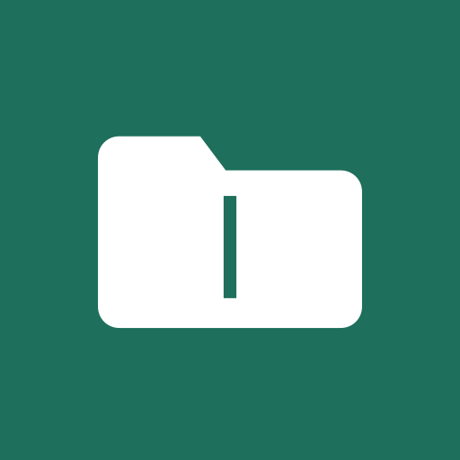
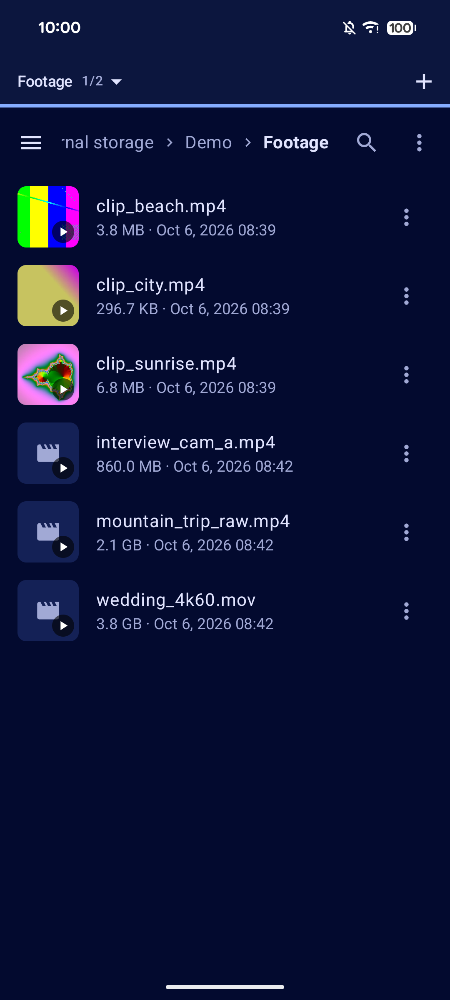
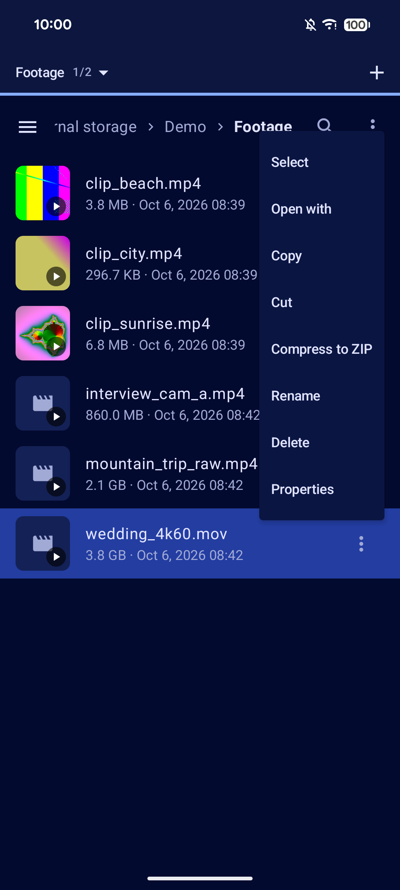
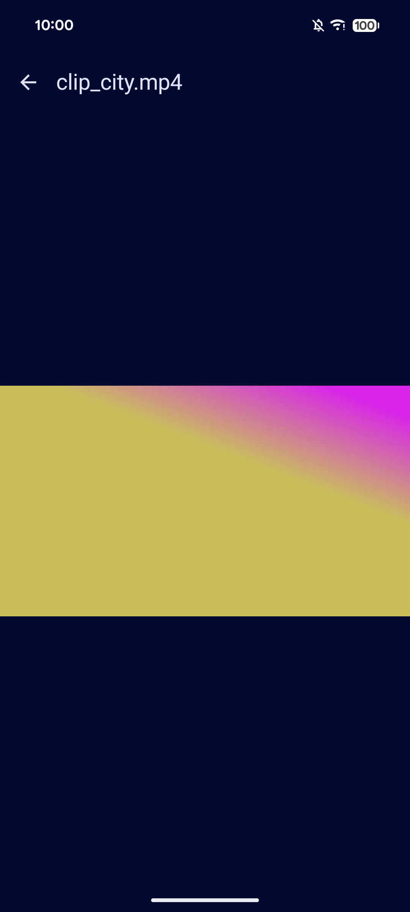

<div align="center">



# UltimateFiles

**A free, dual-panel file manager for Android, built for huge files and for moving things to your own cloud.**

[](https://github.com/qtekfun/UltimateFiles/actions/workflows/ci.yml)
[](https://github.com/qtekfun/UltimateFiles/releases/latest)
[](LICENSE)


&nbsp;
&nbsp;


</div>

UltimateFiles is made for people who shuffle large files around: video footage, backups, whole photo libraries. It is
**F-Droid friendly by design**: no Google Play Services, no analytics, no closed-source dependencies, and nothing is ever
sent to third parties.

## Highlights

| | |
|---|---|
| **Dual panel** | Two panels side by side on wide screens, swipeable tabs on phones, drag and drop between them |
| **Huge files** | Resumable, verified copies that survive the screen turning off |
| **Your own cloud** | Nextcloud/WebDAV, SFTP and SMB as first-class locations |
| **Archives as folders** | Browse ZIP, 7z, TAR and TAR.GZ without extracting them |
| **No FABs** | Contextual action bar on top, docked bars at the bottom |

## Features

### Browsing
- **Two panels:** swipeable tabs in portrait, a 50/50 split in landscape and on wide screens, with drag and drop between
  panels and a "Copy or move?" confirmation.
- **Navigation:** breadcrumb path bar, search by name, sorting, list or grid view, and a side drawer with volumes
  (internal storage, USB OTG, SD card) and shortcuts.
- **No floating buttons:** a contextual top bar while selecting, a per-item menu, and a docked paste bar at the bottom.
- **Properties** with permissions and MD5/SHA-256 hashes.
- **Built-in viewers** for images (with zoom), text, PDF, audio and video; "Open with…" hands off to other apps.
- **Open APKs:** asks once for the "install unknown apps" permission, then hands over to the system installer.

### Copying and moving
- **Background transfers** run in a foreground service with a notification showing progress, speed and time left. It is
  visible on the lock screen and supports **pause/resume** and cancel.
- **Huge files** are written under a temporary name (`*.ultimatefiles-part`) and renamed when done. Optional SHA-256
  verification runs before the source is deleted in a move. Conflicts can be overwritten, skipped or renamed, with
  "apply to all".
- **Task history**, including running and queued tasks.

### Remote locations
- **Nextcloud / WebDAV:** sign in with *Login Flow* in your browser, so you never type or store your real password, only a
  revocable app password encrypted with the Android Keystore. Uploads are chunked and resumable, downloads use `Range`.
  HTTPS is the default. For self-hosted servers you can trust a self-signed certificate (its SHA-256 fingerprint is pinned
  per account, "accept everything" is never an option) or allow plain HTTP after an explicit confirmation.
- **SFTP:** password or private key (PEM, with optional passphrase). The first time, you see the server's `SHA256:` host key
  fingerprint and pin it per account; if it ever changes, the connection is refused. Copies cannot be resumed.
- **SMB** (Windows, Samba, NAS): accounts with optional domain, user and password. **Not tested against a real server yet**
  (it compiles and its paths are unit-tested); no explicit encryption and no resuming.

### Archives
- Tap a **ZIP, 7z, TAR or TAR.GZ** to open it as a read-only folder, even when it lives on a remote server or inside another
  archive. Copying out of it works like any other copy.
- **Extract here** and **Compress to ZIP** live in each file's menu and in the selection menu, and go through the same
  queue as copies (progress, pause, history). Extraction creates a new folder, is rolled back entirely if it fails, and
  rejects `../` entries.
- Other apps can open archives with UltimateFiles ("Open with"). Encrypted 7z is not supported, and 7z files cannot be
  created.

### Settings
- Theme (system, light, dark, AMOLED), dynamic colors, copy verification.
- **Backup:** export and import settings and accounts. Passwords are encrypted with a passphrase you choose.

## Long copies with the screen off

Android may cut the network or stop an app when the screen turns off (Doze, each vendor's battery saver). To make long
copies survive, UltimateFiles keeps the CPU and Wi-Fi awake while copying, asks you once to exclude it from battery
optimization (Settings, in the battery check) and keeps a journal of unfinished work. If the system kills the
app, it offers to resume when you come back (on Nextcloud, the upload continues where it stopped). Some vendors have an
extra battery manager of their own; if copies still stop, look for UltimateFiles there. More at
[dontkillmyapp.com](https://dontkillmyapp.com).

## Permissions

| Permission | Why |
|---|---|
| `MANAGE_EXTERNAL_STORAGE` | Access to all files |
| Foreground service (data sync) | Long copies with a persistent notification |
| Notifications | Progress and results |
| `WAKE_LOCK` | Long copies with the screen off |
| `REQUEST_IGNORE_BATTERY_OPTIMIZATIONS` | Same, asked once |
| `INTERNET` | Only for Nextcloud/WebDAV, SFTP and SMB accounts |
| `REQUEST_INSTALL_PACKAGES` | Opening APKs |

## Install

- **Releases:** download the signed APK from the [latest release](https://github.com/qtekfun/UltimateFiles/releases/latest).
  Releases are signed with the project key; check the certificate with
  `apksigner verify --print-certs UltimateFiles-X.Y.Z.apk`.
- **Nightlies:** every push to `master` publishes a pre-release with its own application id
  (`com.qtekfun.ultimatefiles.nightly`), so it installs next to the official app.
- **F-Droid:** the build recipe lives in [`fdroid/`](fdroid) and is being submitted. See [docs/FDROID.md](docs/FDROID.md).

## Development

```
./gradlew testDebugUnitTest lintDebug assembleDebug
```

Java 21, Kotlin 2.x, Jetpack Compose with Material 3, Koin, DataStore and OkHttp. See [PRD.md](PRD.md),
[ARCHITECTURE.md](ARCHITECTURE.md) and [TASK_PLAN.md](TASK_PLAN.md).

The Nextcloud tests run against an in-memory fake server, and the 8 GiB copy test against a generated stream: they are no
substitute for a real test on a device.

## CI/CD

- `ci.yml`: tests, version check, lint, debug APK and a release build on every PR and push to `master` and `claude/**`
  branches.
- `ui-tests.yml`: instrumented Compose UI tests on an emulator.
- GitGuardian: secret scanning through its GitHub app, with no workflow or API key.
- `release.yml`: a `vX.Y.Z` tag publishes the **official release** (`UltimateFiles-X.Y.Z.apk`, signed with the project key,
  notes taken from `CHANGELOG.md`; it fails without the `UF_*` secrets). Every push to `master` publishes a **nightly**.
  How to sign and publish: [RELEASING.md](RELEASING.md).
- `reproducible.yml`: builds the release twice from different directories and compares the APKs the way F-Droid does.
- Dependabot: Gradle and GitHub Actions, weekly.
- Versioning: `appVersion` in `gradle.properties`; `versionCode` is derived from it.

## Name and package

The app is called **UltimateFiles**, its application id is `com.qtekfun.ultimatefiles` and the repository is
`qtekfun/UltimateFiles`.

Versions published before the rename used a different application id, so Android treats them as another app: the new one
installs next to it and does not inherit its settings or accounts. To carry your data over, export a backup from the old
version first (Settings → Backup) and import it into the new one.

## License

[GPL-3.0-or-later](LICENSE)
